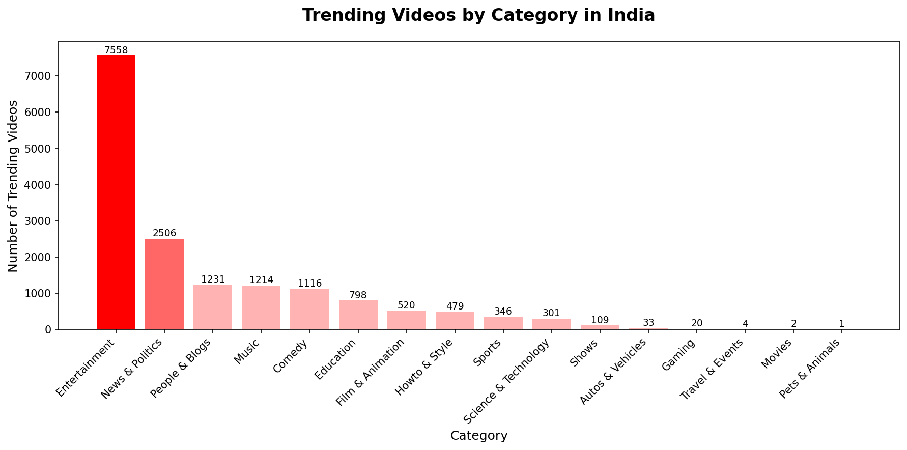
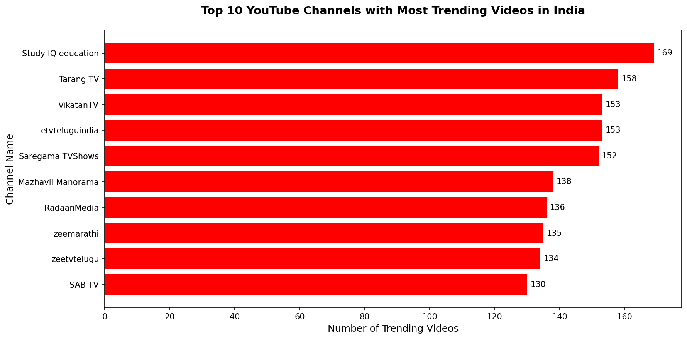
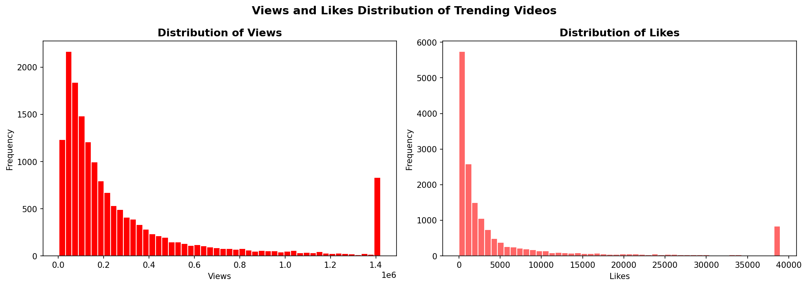
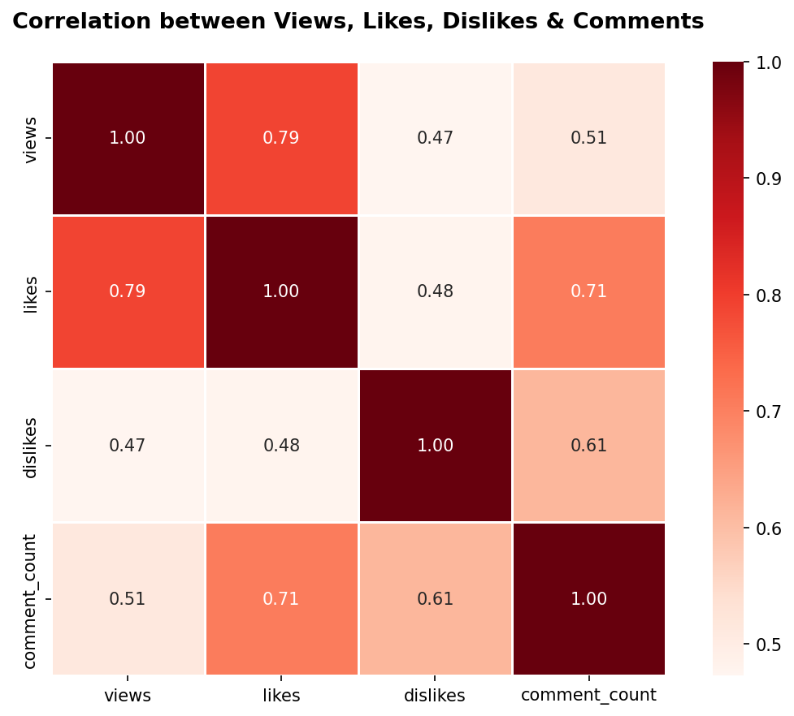
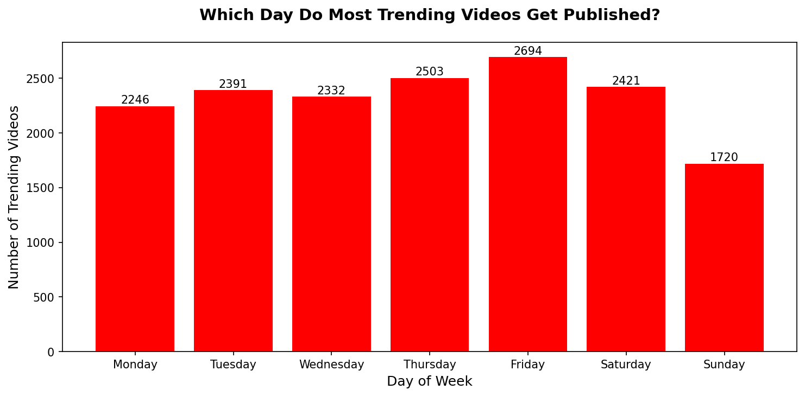
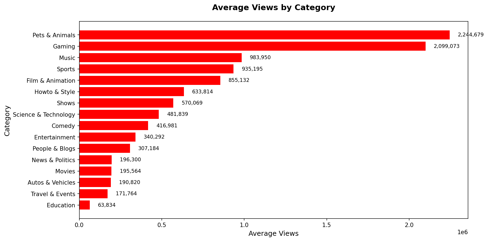

# 📺 YouTube Trending Videos India — Exploratory Data Analysis


---

## 📌 Project Overview

This is an Exploratory Data Analysis project on real YouTube trending video data from India. The goal was to uncover what makes a video trend in India — which categories dominate, which channels appear most, what is the best day to post, and how views relate to likes and comments.

> *"Analyzed 40,000+ real YouTube trending videos from India using Python to identify content patterns, audience behavior, and virality drivers across 17 categories and 1,422 unique channels."*

---

## 🎯 Business Problem

A content creator or digital marketing analyst wants to understand:
- Which video categories trend the most in India?
- Which YouTube channels dominate the trending page?
- What is the best day of the week to publish a video?
- Which category gets the highest average views?
- How strongly are views, likes, dislikes and comments correlated?

---

## 🛠️ Tools & Libraries Used

| Tool | Purpose |
|------|---------|
| Python | Core programming language |
| Pandas | Data loading, cleaning, manipulation |
| Matplotlib | Data visualization |
| Seaborn | Statistical visualizations |
| Jupyter Notebook (VS Code) | Development environment |

---

## 📂 Project Structure

```
YouTube-Trending-EDA/
│
├── INvideos.csv                          # Raw dataset (40K+ rows)
├── IN_category_id.json                   # Category mapping file
├── youtube_eda.ipynb                     # Complete EDA notebook
│
├── viz1_category_distribution.png        # Trending videos by category
├── viz2_top_channels.png                 # Top 10 channels
├── viz3_views_likes_distribution.png     # Views & likes distribution
├── viz4_correlation_heatmap.png          # Correlation heatmap
├── viz5_best_day_to_post.png             # Best day to publish
├── viz6_avg_views_category.png           # Avg views by category
│
└── README.md
```

---

## 📊 Dataset Overview

- **Source:** Kaggle — Trending YouTube Video Statistics
- **Country:** India (IN)
- **Size:** 40,000+ trending video records
- **Time Period:** 2017 - 2018

| Column | Description |
|--------|-------------|
| video_id | Unique video identifier |
| trending_date | Date video was trending |
| title | Video title |
| channel_title | YouTube channel name |
| category_id | Numeric category ID |
| publish_time | When video was published |
| views | Total view count |
| likes | Total like count |
| dislikes | Total dislike count |
| comment_count | Total comment count |
| category_name | Category name (mapped from JSON) |

---

## 🔍 Key Insights

### 1. Entertainment Dominates Trending
**Entertainment** is the most trending category with **7,558 videos** — almost 3x more than the second category (News & Politics with 2,506). This tells us Indian audiences primarily use YouTube for entertainment.

### 2. Study IQ Education is the Top Channel
**Study IQ Education** appeared **169 times** on the trending page — highest among all 1,422 channels. Educational content has a strong and consistent audience in India.

### 3. Friday is the Best Day to Post
Videos published on **Friday (2,694)** trend the most, followed by Thursday (2,503) and Saturday (2,421). Sunday has the lowest trending videos (1,720) — avoid posting on weekends.

### 4. Pets & Animals Gets Highest Average Views
Despite having very few trending videos, **Pets & Animals** category averages **2,244,679 views per video** — highest of all categories. Gaming comes second at 2,099,073 avg views.

### 5. Views and Likes Are Strongly Correlated
Correlation between views and likes is **0.79** — very strong positive relationship. Videos with more views naturally get more likes, but the relationship isn't perfect — some videos get high views but low engagement.

### 6. Most Videos Have Under 500K Views
The views distribution is heavily right-skewed — most trending videos have under 500K views, but a few viral videos have over 1M+ views pulling the average up to 397,775.

---

## 📈 Visualizations

### Viz 1 — Trending Videos by Category


### Viz 2 — Top 10 Channels


### Viz 3 — Views & Likes Distribution


### Viz 4 — Correlation Heatmap


### Viz 5 — Best Day to Post


### Viz 6 — Average Views by Category


---

## 💡 Business Recommendations

1. **Create Entertainment content** — it has the highest trending frequency in India
2. **Post on Fridays** — highest chance of trending
3. **Don't ignore niche categories** — Pets & Animals and Gaming get massive average views despite fewer trending videos
4. **Focus on engagement** — views and likes are strongly correlated (0.79), so engaging content drives both
5. **Study IQ's success shows** — educational content with consistent posting builds a loyal trending audience

---

## 🚀 How to Run This Project

```bash
# Clone the repository
git clone https://github.com/prerna1904/YouTube-Trending-EDA.git

# Install required libraries
pip install pandas matplotlib seaborn jupyter

# Open the notebook
jupyter notebook youtube_eda.ipynb
```

---

## 👩‍💻 Author

**Prerna Malhotra**
Aspiring Data Analyst | Python • SQL • Power BI • Excel
📧 prernamalhotra767@gmail.com
🔗 https://www.linkedin.com/in/prerna-malhotra-/

---

⭐ If you found this project helpful, please give it a star!
